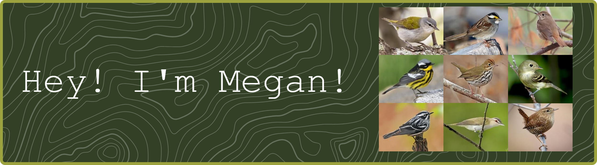

I'm a wildlife biologist and a new PhD student at the University of Alberta. 
My passion lies in understanding how birds respond to environmental change in the boreal forest, but more broadly, conservation is at the heart of my work.

You can find out more here: https://megredgar.github.io/megedgar/ 
and here: https://www.linkedin.com/in/meganredgar/

<!--
**megredgar/megredgar** is a ✨ _special_ ✨ repository because its `README.md` (this file) appears on your GitHub profile.

Here are some ideas to get you started:

- 🔭 I’m currently working on ...
- 🌱 I’m currently learning ...
- 👯 I’m looking to collaborate on ...
- 🤔 I’m looking for help with ...
- 💬 Ask me about ...
- 📫 How to reach me: ...
- 😄 Pronouns: ...
- ⚡ Fun fact: ...
-->
